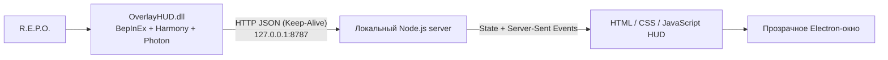

# OverlayHUD (Multiplayer Fix & Ultimate Optimization)

Локальный HUD-оверлей для **R.E.P.O.**, который показывает информацию о текущем забеге в отдельном прозрачном окне поверх игры.

**Оригинальный автор:** EgorSalad (Dunweir)  
**Автор мультиплеерного форка:** NeverFun21

> **OverlayHUD** — неофициальный фанатский проект. Он не связан с semiwork, издателем R.E.P.O. или Thunderstore. Данный репозиторий является оптимизированным форком, созданным для идеальной работы в мультиплеере.

## ⚡ Что нового в этой версии (Fork Features)

Оригинальный мод отлично работал для хоста, но вызывал рассинхронизацию у клиентов и просадки производительности. Этот форк полностью решает эти проблемы:
- **Полная поддержка клиентов:** Оверлей корректно активируется у всех игроков в лобби (включая магазин) и автоматически скрывается на Арене.
- **Глобальная синхронизация (Photon Events):** Игроки с установленным модом образуют невидимую сеть. Если один игрок обнаружил монстра, он появляется в оверлее у всей команды. Хост раздает клиентам точный таймер респавна до миллисекунд.
- **Синхронизация здоровья (HP Fix):** Убраны задержки полоски здоровья при получении урона монстрами.
- **Ultimate Optimization:** Сетевые HTTP-запросы плагина переведены на технологию `Keep-Alive`. Мод больше не спамит тысячами TCP-соединений, что полностью устраняет скачки пинга и падение FPS.

## 👁‍🗨 Как выглядит OverlayHUD

**HUD во время игры:**  

**Панель настроек:**  

## ⚙️ Возможности оверлея

HUD умеет показывать:
- встреченных монстров и их уровень силы;
- текущее и максимальное здоровье монстров;
- состояние монстра и оставшееся время до респавна (или иконку 💀 для неизвестного таймера);
- номер уровня и таймер прохождения;
- улучшения игрока и текущую/потерянную стоимость ценностей на карте.

**Настройки окна:**
- прозрачное окно поверх игры (пропуск кликов сквозь окно);
- перетаскивание и привязка к краям экрана;
- изменение масштаба интерфейса и количества колонок;
- русский и английский интерфейс;
- умное скрытие при удержании `Tab` или потере фокуса окна (`Alt-Tab`).

### Горячие клавиши Desktop-оверлея

| Сочетание | Действие |
| --- | --- |
| `Ctrl+Alt+O` | Показать или скрыть окно |
| `Ctrl+Alt+I` | Включить или выключить пропуск кликов |
| `Ctrl+Alt+R` | Перезагрузить страницу оверлея |
| `Ctrl+Alt+Q` | Закрыть OverlayHUD |

## 🛠 Установка

Мод можно установить двумя способами: вручную или через менеджер модов (Thunderstore Mod Manager / r2modman / Gale).

**Требования:** Установленный **BepInEx** (версии 5.x).

### Способ 1: Ручная установка (в папку профиля)
1. Скачайте файлы `OverlayHUD.dll` и `OverlayHUD_app.zip` из раздела **Releases**.
2. В менеджере модов выберите профиль игры, перейдите в **Settings** и нажмите **Browse profile folder** (Открыть папку профиля).
3. Перейдите по пути `BepInEx\plugins\`.
4. Создайте новую папку для мода. Назовите её коротко (например, `OverlayHUD`).
   > ⚠️ **Важно:** В Windows есть ограничение на длину пути (260 символов). Если название папки будет слишком длинным, оверлей не сможет распаковать свои файлы и не появится на экране (Ошибка `0x80010135`).
5. Поместите оба скачанных файла в эту папку. 
6. **Не распаковывайте `OverlayHUD_app.zip` вручную!** Просто запустите игру, и плагин сам извлечет локальный сервер.

### Способ 2: Установка через менеджеры модов
1. Скачайте установочный `.zip` пакет мода из раздела **Releases**.
2. Откройте менеджер модов и выберите ваш профиль с игрой R.E.P.O.
3. **Для Gale:** Нажмите кнопку **Import** сверху, выберите **Local mod** и укажите скачанный архив. 
4. **Для Thunderstore:** Перейдите во вкладку **Settings** -> **Import local mod** и выберите архив. Менеджер установит всё автоматически.

## 🧠 Как это работает (Архитектура)

- **Игровой плагин (`Plugin.cs`):** Загружается через BepInEx и с помощью Harmony подписывается на игровые события. Новая система кэширования `Reflection` снижает нагрузку на Unity, а `PhotonEvents` синхронизирует обнаружение мобов между клиентами.
- **Локальный сервер (`server.js`):** Хранит состояние HUD. Слушает только `127.0.0.1:8787` (данные не уходят в интернет).
- **Desktop-приложение:** Создаёт прозрачное click-through окно Electron. Плагин безопасно распаковывает `OverlayHUD_app.zip` при старте и запускает `OverlayHUD.exe`.

## 📋 Диагностика и Ограничения

Главный источник информации — файл `BepInEx/LogOutput.log`.
Если HUD не появляется:
1. Проверьте, что игра запущена в **windowed** или **borderless** режиме (обычное окно не может отображаться поверх exclusive fullscreen).
2. Убедитесь, что папка мода имеет короткое название (иначе архив не распакуется).
3. Проверьте наличие `OverlayHUD_app/OverlayHUD.exe` рядом с DLL мода.
4. Убедитесь, что порт `8787` не занят другим процессом.

## ⚖️ Лицензия и Зависимости
Исходный код OverlayHUD распространяется по лицензии [MIT](LICENSE).
Шрифты (Roboto, Teko), зависимости (Electron, Node.js, BepInEx), игровые изображения и торговые марки не перелицензируются под MIT. Их условия и сведения об авторстве перечислены в файле [THIRD_PARTY_NOTICES.md](THIRD_PARTY_NOTICES.md).